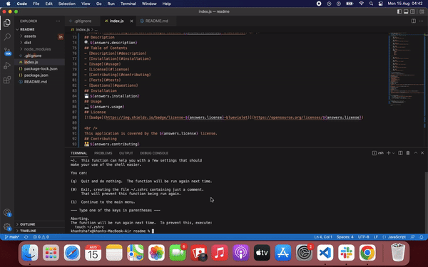

<h1 align="center">README.md Generator Using Node.js</h1>
   
  
<p align="center">
    
    
    
    
</p>
  
<p align="center">
    
    
    
    
    
</p>
   
## Description
  
🔍 A node.js application that uses user input from inquirer to populate a README.md file for user repository. The README.md file is created in the dist directory and can be found [here]()  
  
💻 Below is the gif showing the functionality of the application:
  

  
🎥 The full movie file showing functionality of the application can be found [here](assets/Screen Recording 2022-08-15 at 04.42.55.mov)  
  
## User Story
  
```
AS A developer
I WANT a README generator
SO THAT can quickly create a professional README for a new project 
```
  
## Acceptance Criteria
  
``` 
GIVEN a command-line application that accepts user input
WHEN I am prompted for information about my application repository
THEN a high-quality, professional README.md is generated with the title of my project and sections entitled Description, Table of Contents, Installation, Usage, License, Contributing, Tests, and Questions
WHEN I enter my project title
THEN this is displayed as the title of the README
WHEN I enter a description, installation instructions, usage information, contribution guidelines, and test instructions
THEN this information is added to the sections of the README entitled Description, Installation, Usage, Contributing, and Tests
WHEN I choose a license for my application from a list of options
THEN a badge for that license is added near the top of the README and a notice is added to the section of the README entitled License that explains which license the application is covered under
WHEN I enter my GitHub username
THEN this is added to the section of the README entitled Questions, with a link to my GitHub profile
WHEN I enter my email address
THEN this is added to the section of the README entitled Questions, with instructions on how to reach me with additional questions
WHEN I click on the links in the Table of Contents
THEN I am taken to the corresponding section of the README
```
  
## Table of Contents
- [Description](#description)
- [User Story](#user-story)
- [Acceptance Criteria](#acceptance-criteria)
- [Table of Contents](#table-of-contents)
- [Installation](#installation)
- [Usage](#usage)
- [Contributing](#contributing)
- [Questions](#questions)

## Installation
💾   
  
`npm init`
  
`npm install inquirer`
  
## Usage
💻   
  
Run the following command at th root of your project and answer the prompted questions:
  
`node index.js`

## Contributing
:octocat: [Ha Nguyen](https://github.com/nguyendinhkhanhha296)

## Questions
✉️ Contact me with any questions: [email](mailto:nguyendinhkhanhha296@gmail.com) , [GitHub](https://github.com/nguyendinhkhanhha296)<br />
